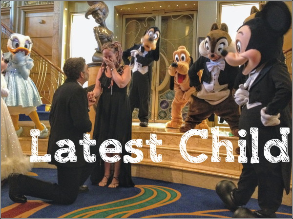

# latest-child

'Latest Child' is a WordPress [child theme](https://codex.wordpress.org/Child_Themes) which modifies the '[latest](http://uxlthemes.com/theme/latest)' theme, by [uXL Themes](http://uxlthemes.com). Both themes are shared with you under the terms of the [GNU General Public License](http://www.gnu.org/licenses/).

I'm using Latest Child as a proving ground for [WordPress](https://wordpress.org/) exploration, while providing added functionality for clients who are running their websites with  the 'Latest' theme.

As I roll in functionality I'll add updates here.